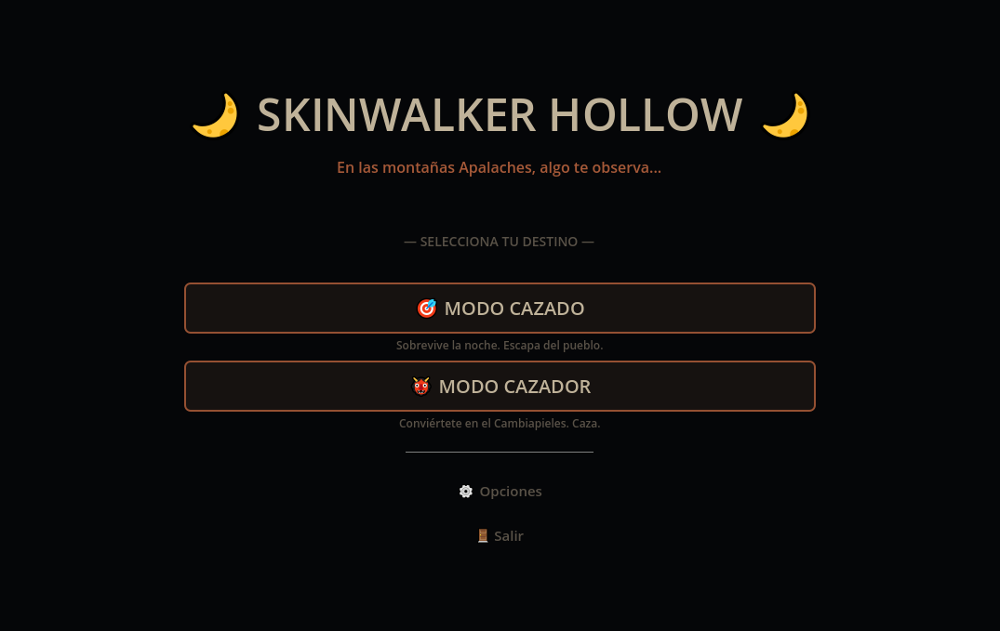
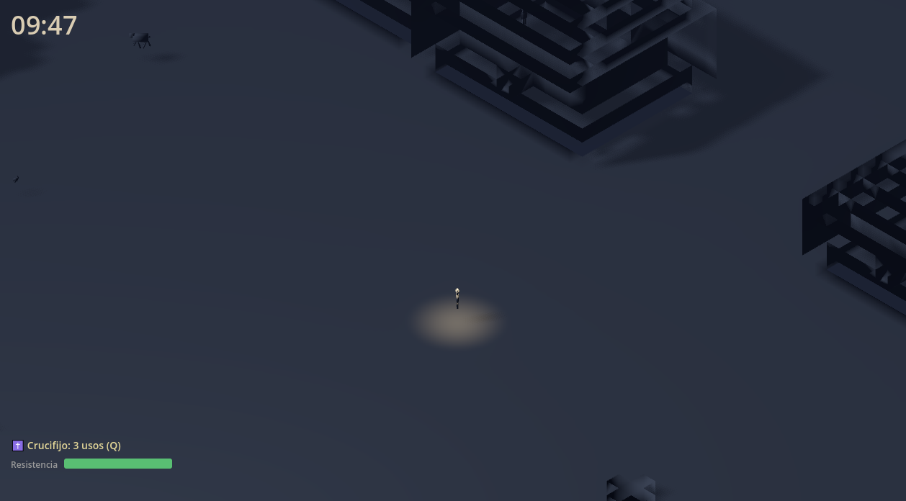
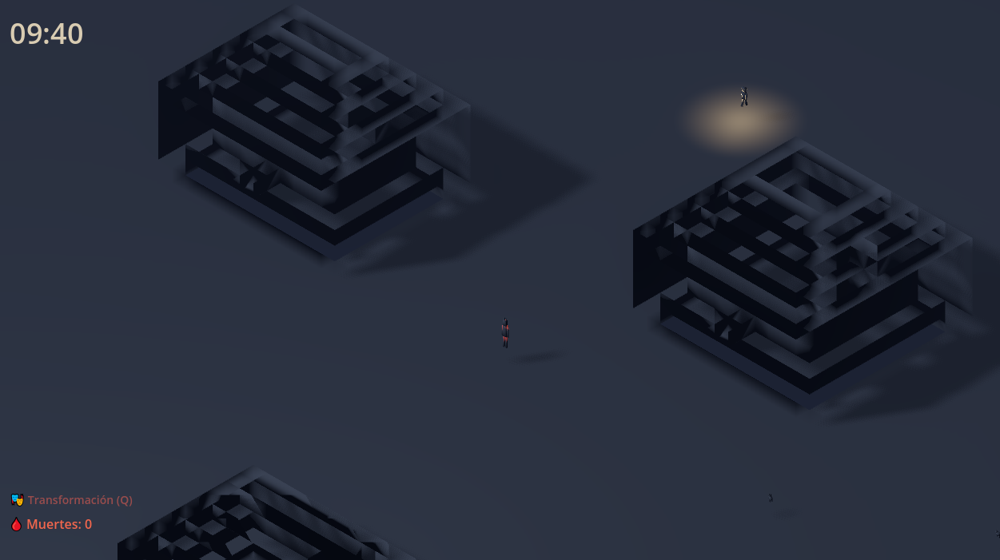

# 🐾 Skinwalker Hollow

**Skinwalker Hollow** es un videojuego de terror y supervivencia en mundo abierto desarrollado con **Godot 4.4**, ambientado en las montañas de los Apalaches. Juega como un aldeano atrapado en una noche oscura, siendo cazado por una criatura que puede tomar la forma de cualquier ser vivo... o como el propio cazador, controlando al Cambiapieles para eliminar a tu presa antes de que escape.

---

## 🎮 Modos de juego

| Modo | Rol | Objetivo | Duración |
|------|-----|----------|----------|
| **Hunted** (Cazado) | Superviviente | Escapa del pueblo antes de que el Cambiapieles te encuentre | 10 min |
| **Hunter** (Cazador) | Cambiapieles | Caza a tu presa principal y al resto de aldeanos antes de que el amanecer llegue | 10 min |

---

## 📱 Capturas de Pantalla

<p align="center">
  
  
  
</p>

---

## 🔦 Características principales

- ✅ **Mapa procedural**: pueblo generado automáticamente con casas, caminos, cementerio, pozo y bosques
- ✅ **IA dinámica** del Cambiapieles con 3 fases de tensión progresiva
- ✅ **Disfraz interactivo**: el cazador puede hacerse pasar por aldeanos o animales
- ✅ **Sistema de distracciones**: usa señuelos, ruidos y caminos falsos para confundir al enemigo
- ✅ **Iluminación nocturna** con linternas, faroles y luz de luna
- ✅ **Cámara isométrica** con zoom adaptable (rueda del mouse)
- ✅ **Atmósfera sonora** procedural (viento, gritos, pasos, latidos)
- ✅ **Persistencia**: guarda partidas, estadísticas y configuración
- ✅ **Multiplataforma**: PC y Android (controles táctiles preparados)

---

## 🧠 Mecánicas de tensión (fases)

| Fase | Tiempo | Eventos | Comportamiento del Cambiapieles |
|------|--------|---------|----------------------------------|
| 1 | 0-1 min | “Algo no está bien” | Acecha disfrazado |
| 2 | 1-3 min | “Te están cazando” | Comienza la persecución |
| 3 | 3-7 min | “CORRE” | Velocidad y agresividad máxima |

---

## 🕹️ Controles

| Acción | Tecla | Móvil |
|--------|-------|-------|
| Movimiento | WASD o flechas | Joystick virtual |
| Correr | Shift | Botón |
| Interactuar | E / Espacio | Botón |
| Distracción / Transformarse | Q | Botón |
| Pausa | Esc | Botón |
| Zoom | Rueda del mouse | Pellizcar |

---

## 🛠️ Tecnologías

- **Godot 4.4** (Forward+)
- **GDScript** 100%
- **Procedural mesh generation** (SurfaceTool)
- **Sistema de eventos desacoplado** (EventsBus)
- **Autoloads**: Config, GameManager, TimeManager, SaveSystem, AudioManager, InputManager
- **Arquitectura modular**: entidades, sistemas, mundo, UI

---

## 📦 Instalación

1. Descarga la última versión desde [Releases](https://github.com/ArielNeR/SkinkWalker-Hollow/tree/main/releases)
2. PC: ejecuta [SkinwalkerHollow.exe](https://github.com/ArielNeR/SkinkWalker-Hollow/tree/main/releases/SkinwalkerHollow.exe)

---

## 🧪 Desarrollo

### Requisitos

- Godot 4.4+
- Git

### Clonar y ejecutar

```bash
git clone https://github.com/ArielNeR/skinwalker-hollow.git
cd skinwalker-hollow
# Abre project.godot con Godot 4.4
```

### Estructura de carpetas

```
arielner-skinkwalker-hollow/
├── core/                 # Autoloads (config, eventos, game manager)
├── entities/             # Jugador, NPCs, Skinwalker, animales
├── systems/              # Tiempo, distracciones, guardado
├── world/                # Generación procedural, chunks, bloques
├── rendering/            # Cámara isométrica, iluminación, chunks
├── audio/                # Sistema de audio atmosférico
├── input/                # Controles multiplataforma
├── ui/                   # HUD, menús, notificaciones
└── scenes/               # Escenas principales
```

---

## 🎨 Assets

- **Modelos**: 100 % procedurales (cubos) sin dependencias externas
- **Audio**: generado proceduralmente (pendiente de implementar archivos `.wav`/`.ogg`)
- **Paleta de colores**: configurable en `core/config.gd`

---

## 📄 Licencia

Código abierto bajo MIT.  
---